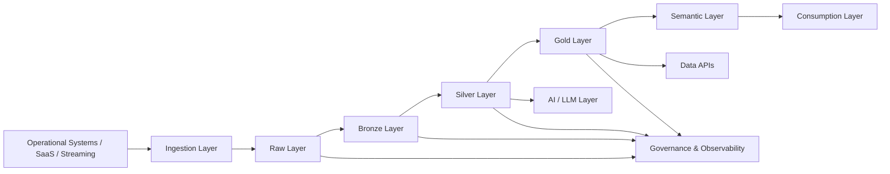
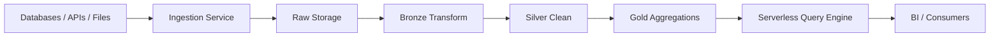
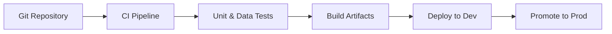
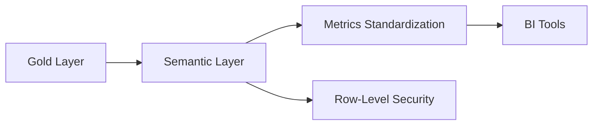
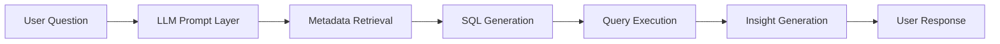
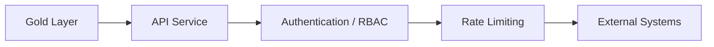
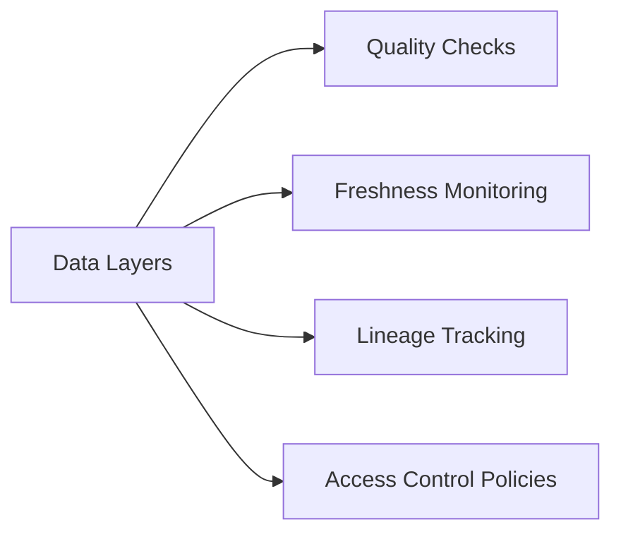
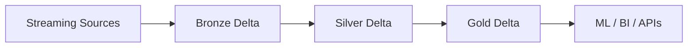

# 🚀 Modern Data Platform Architecture Lab  
### Enterprise-Grade Multi-Cloud Data Platform | AI-Enabled | Production-Ready

---

## 📌 Executive Summary

This repository presents the architecture, design decisions, and implementation blueprint of a **production-grade Modern Data Platform**.

It demonstrates end-to-end capabilities across:

- Serverless Data Warehousing (AWS)
- Multi-Cloud Data Pipelines
- Self-Service Analytics
- Augmented Analytics with LLMs
- Data APIs
- Governance, Observability & Security
- Databricks Lakehouse Architecture
- 7-Layer Modern Data Stack Implementation

This is not a collection of isolated pipelines —  
this is a **scalable, enterprise-ready data platform architecture**.

---

# 🏗 High-Level Platform Architecture

---

# 🧠 Architectural Philosophy

### 1️⃣ Platform Thinking
Designed as a scalable data platform, not a pipeline collection.

### 2️⃣ Cloud-Native & Elastic
Serverless-first, decoupled storage/compute, auto-scaling by design.

### 3️⃣ Infrastructure as Code
All infrastructure reproducible, versioned, environment-isolated.

### 4️⃣ Governance Embedded
Data quality, lineage, RBAC and monitoring are core components — not add-ons.

### 5️⃣ AI-First Integration
LLMs and augmented analytics integrated into the platform lifecycle.

---

# 📂 Project Modules

---

# 1️⃣ Serverless Data Warehouse (AWS)

## Objective
Design a fully serverless, elastic, cost-efficient data warehouse architecture using Medallion principles.

## Architecture

## Engineering Considerations

- Partitioning strategies
- Late-arriving data handling
- Schema evolution
- Cost-aware storage tiering
- Workload isolation
- Query performance optimization

## Non-Functional Requirements

✔ Horizontal scalability  
✔ Cost elasticity  
✔ High availability  
✔ Secure access control  

---

# 2️⃣ Multi-Cloud Data Pipelines

## Objective
Build cloud-agnostic, version-controlled pipelines with CI/CD and environment isolation.

## CI/CD Architecture

## Capabilities

- Metadata-driven orchestration
- Parameterized infrastructure
- Automated testing
- Rollback & promotion strategies
- Environment segregation (Dev / Test / Prod)

---

# 3️⃣ Self-Service Analytics

## Objective
Enable governed, scalable, business-driven analytics.

## Architecture

## Enterprise Patterns

- Star schema modeling
- Semantic layer abstraction
- Centralized metrics definitions
- Performance optimization strategies
- Cost governance enforcement

---

# 4️⃣ Augmented Analytics with LLMs

## Objective
Integrate AI into the analytics workflow.

## AI Architecture

## Advanced Capabilities

- Natural Language to SQL
- Retrieval-Augmented Generation (RAG)
- Semantic metadata embeddings
- Conversational analytics
- Controlled prompt engineering
- AI-assisted data discovery

---

# 5️⃣ Data API Platform

## Objective
Expose curated datasets securely through versioned APIs.

## Features

- RESTful architecture
- API versioning
- Contract-first development
- Authentication & authorization
- Monitoring & throttling
- Observability integration

---

# 6️⃣ Governance, Observability & Security

## Governance Framework

- Data Quality validation framework
- Freshness monitoring
- Volume anomaly detection
- Schema drift detection
- Lineage tracking
- Role-based access control
- Policy enforcement

## Observability Architecture

## Design Principles

✔ Security by design  
✔ Compliance-ready architecture  
✔ Data trust as a platform capability  

---

# 7️⃣ Databricks Lakehouse Implementation

## Objective
Build unified batch + streaming analytics using a Lakehouse architecture.

## Highlights

- ACID guarantees with Delta Lake
- Structured Streaming pipelines
- Z-Ordering & partition tuning
- Cost-performance optimization
- Scalable distributed compute

---

# 8️⃣ 7-Layer Modern Data Stack

| Layer | Responsibility |
|-------|---------------|
| 1 | Data Sources |
| 2 | Ingestion |
| 3 | Raw Storage |
| 4 | Transformation |
| 5 | Semantic Modeling |
| 6 | Consumption |
| 7 | Governance & Monitoring |

---

# 🔬 Non-Functional Engineering Focus

This platform was designed considering:

- Distributed systems scalability
- Fault tolerance & recovery
- Cost-performance trade-offs
- Infrastructure reproducibility
- High availability
- Security isolation
- Observability standards
- Maintainability at scale

---

# 🛠 Technologies & Concepts Demonstrated

- Cloud-native architecture
- Serverless compute
- Lakehouse architecture
- CI/CD for Data Engineering
- Infrastructure as Code
- Metadata-driven pipelines
- Data contracts
- API-first architecture
- LLM integration in data systems
- Enterprise governance patterns

---

# 🎯 Target Roles

This repository demonstrates readiness for:

- Senior Data Engineer  
- Staff Data Engineer  
- Principal Data Engineer  
- Data Platform Architect  
- Cloud Data Architect  
- AI Data Architect  

---

# 🧩 What Makes This Big Tech Ready

- Clear separation of concerns
- System design maturity
- Scalability trade-off awareness
- Governance-first architecture
- AI-native data integration
- Production-grade thinking
- Multi-cloud abstraction strategy

---

# 📬 Contact

Open to discussions about system design, trade-offs, scalability patterns, platform engineering, and AI-enabled data architectures.

---

# ⭐ If This Repository Adds Value

Consider starring it and connecting for architectural deep dives.

---
